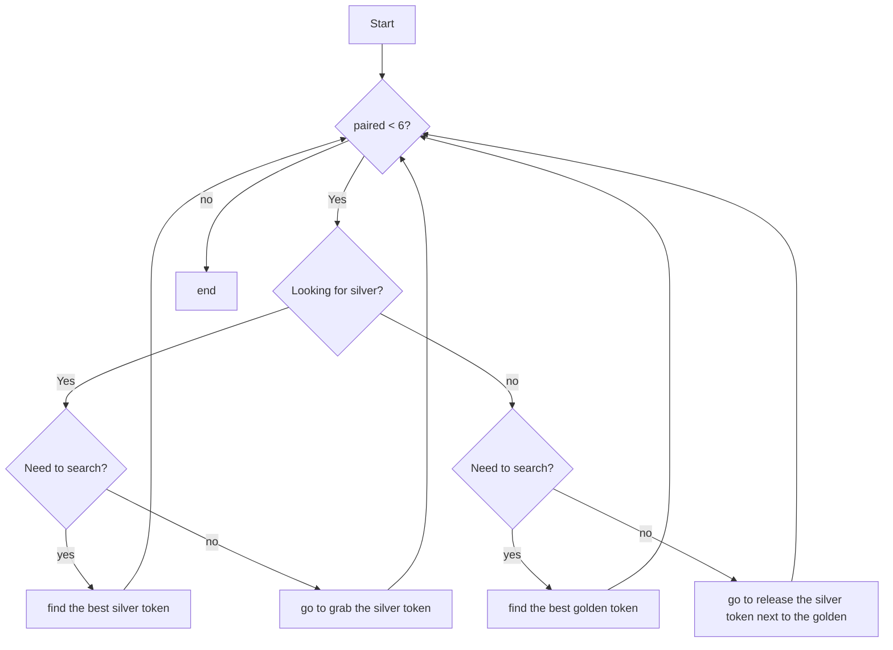

Assignment solution
==========
We discuss here some features and details about the code developed.
The assignment requested the virtual robot to pair silver and golden tokens by moving only the silver ones; the way to do so is free.
The behavior implemented is very general and works for most of the possible configurations of 6 tokens even though it has been slightly optimized for the proposed configuration.
A "complex" behavior has been implemented. The virtual robot turns once in order to see all the silver tokens in order to find the code of the closest one, then it aligns to the chosen token and goes and grab it.
It the repeats the process to find the closest golden token and release the grabbed token next to it.
The whole process is repeated until the number of paired tokens reaches 6, if there had been more than 6 pairs of tokens the programmer would have had to change the value of the variable "size" to the corresponding number and he would have had to properly initialize the arrays "golden_paired" and "silver_paired" .
In order to achieve maximum adherence to what requested the robot constantly checks its angulation with respect to the token he is traveling to, if the angle is "wrong" the robot stops for a while and adjust it.
This is done by setting the variable "smooth" to False. Notice that we could achieve a more flexible movement, it is enough to set that variable to True, such a movement does not satisfy in general the requirements on the rot_y angle, so as a default smooth is set to False.
Several other parameters have been hardcoded in the source code in order to speed-up the global execution time. 
For instance consider the variable "sampling_T", this variable is related to several actions performed by the robot, and it's value is pretty low (sampling_T=0.05).
This means that the robot does a lot of feedback operations in order to adjust its trajectory dynamically even at a high speed, even higher than the one implemented, which guarantees correctness though. 

Flowchart
------------
In the following flowchart it is represented the basic structure of the source code of the assignment.py file 



Notice that whenever "find the best silver/golden token" operation is performed there is no more need to search for it.

Pseudo-code
---------------

As the flowchart was developed before the source code some details may not be clear, in order to provide a more refined representation a python-like pseudo-code of the main and unique thread of execution is reported.

```python
number_of_paired_tokens=0
i_need_to_search=True
i_am_looking_for_silver=False
while number_of_paired_tokens<6:
    if i_am_looking_for_silver:
        if i_need_to_search:
            token_id=i_search_silver()
            i_need_to_search=False
        else: 
            grab_silver_token(token_id)
            i_need_to_search=True
            i_am_looking_for_silver=False
    else:
        if i_need_to_search:
            token_id=i_search_golden()
            i_need_to_search=False
        else:
            release_silver_next_to_gold(token_id)
            i_need_to_search=True
            i_am_looking_for_silver=True
            number_of_paired_tokens = number_of_paired_tokens+1
```
Notice that with few changes in the structure one may be able to pair the tokens moving only the golden tokens instead of the silver ones.

Future improvements
--------------------------
The first improvement that comes to my mind is the management of the linear velocity. When the robot goes to grab a token it's speed is constant but indeed one may change this fact pretty easily.
It would be enough to pass to the drive() function a parameter "speed" that is a function of dist-d_th.

Several others improvements should be done, multithreading would allow the robot to "think" while moving, several more parameters about the physics of the real world might be added in order to optimize the smoothness of the robots' movements.
It would also be nice to make it so that the robot is capable of understanding in its original reference frame the position of all the tokens with respect to him and to plan a-priori an "optimal" trajectory to save time during the execution.
Notice that in real world applications even with a complete optimal trajectory feedback measurements are needed to adjust small inaccuracies and uncertainties in the original measurement. 
